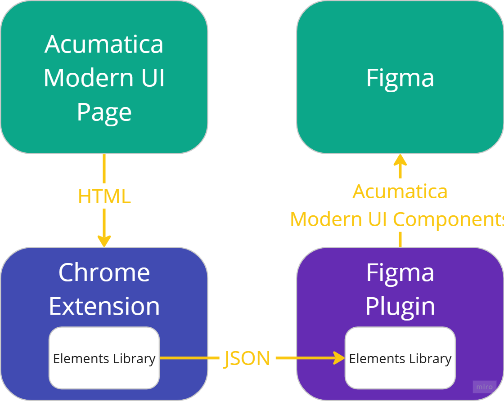

# 🏗️ Acumatica Modern UI To Figma

This is a **monorepository** containing multiple projects related to **Acumatica Modern UI**. It includes a **Chrome extension** for parsing UI, a **Figma plugin** for rendering UI components, and a shared **elements library** for managing parsed data.

## 📂 Project Structure

- `` – Shared library of general interfaces, representing the parsed HTML structure. Used by both the **Chrome extension** and the **Figma plugin**.
- `` – Chrome extension that parses Acumatica Modern UI pages and passes the structured JSON through the **Elements Library**.
- `` – Figma plugin that takes the structured JSON (processed via **Elements Library**) and renders an Acumatica page using predefined **Acumatica Modern UI components**.

## 🔄 Component Interaction Diagram

Below is the flow of data between components:

1. **Chrome Extension** → **Elements Library** → **Parsed JSON**
2. **Parsed JSON** → **Elements Library** → **Figma Plugin** → **Rendered UI in Figma**




## 🚀 Getting Started

### 📦 Install dependencies

Run the following command from the **root** of the repository:

```sh
npm install
```

### 🏗️ Build all projects

```sh
npm run build
```

### 🛠️ Lint all projects

```sh
npm run lint
```

### 🧪 Run tests

```sh
npm run test
```

## 🛠️ Monorepo Setup

This repository uses **npm workspaces** to manage multiple projects efficiently:

- A **single `package-lock.json`** is maintained at the root.
- A **common ESLint configuration** (`eslint.config.mjs`) is used across all projects.

---

🚀 Now you're ready to develop! 🎨 Happy coding!

